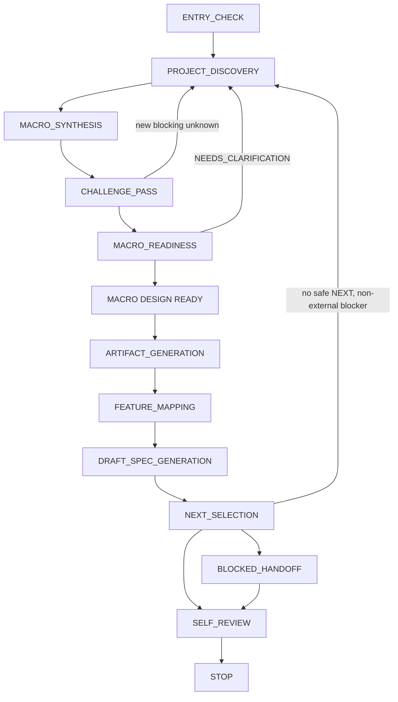

# coding-start — Overview & State Machine

`coding-start` moves an unimplemented project idea to a state that can be handed to Feature development. It clarifies direction, boundaries, and durable rules **before** producing project-level documents and a shallow Feature map. By default it writes no business code and creates no full scaffolding.

## When it triggers

**Enter only when** the user explicitly asks to start or initialize a Greenfield project — including a single-Feature phrasing for a project that has no macro baseline yet.

**Do not enter** when:

- The directory has material business code, a runnable system, migrations, or historical behavior → route to [`project-onboard`](../project-onboard/).
- The user wants to build/fix one Feature and a credible macro baseline exists → route to [`feature-dev`](../feature-dev/).
- The user only wants discussion or evaluation, or has not authorized writes → interview or answer, but stop before formal artifacts.

If Greenfield vs Brownfield is unclear, ask one entry-classification question; never guess or overwrite existing content.

## The state machine

After valid entry and explicit local-write authorization, root [`STAGE.md`](../guide/project-stage) is the sole pre-Gate operational artifact. It checkpoints the current member, Skill stage, blocker, next question, ref, and authority links so Discovery can resume. It contains no unconfirmed product/architecture decisions and never implies `MACRO DESIGN READY`.

Formal project documents are generated only after `MACRO DESIGN READY`. Interview summaries and candidate recommendations are not formal artifacts.

Two **Confirmation Digest** checkpoints keep generated content reviewable without interviewing every point: after Macro Synthesis, every `RECOMMENDED`/`UNKNOWN` Ledger entry is presented in one topic-grouped pass for explicit disposition before the Challenge Pass; and after documents and DRAFT Specs are generated, the entries actually appearing in them are reconciled against that digest before `NEXT` selection, so no default reaches a document the user never saw. See [Discovery & Challenge Pass](./discovery).

## Non-negotiable boundaries

- No business implementations, business APIs, database tables, domain classes, pages, or components by default.
- No full application scaffolding by default.
- Macro design fixes **direction, boundaries, rules, and constraints** — it must not freeze DTOs, fields, classes, components, internal functions, message topics, cache keys, or pixel details.
- Must not mature a `DRAFT` Spec or run `SPEC READY` / `UI READY` / `TEST DESIGN READY`.
- Must not create Feature implementation Issues or PRs (those belong to `feature-dev`).
- Local-write authorization does not authorize `git commit/push`, remote Issues/PRs, merge, or release. See [Authorization](../guide/authorization).

## Minimal non-business scaffolding (exception)

Only when explicitly requested, and only after `MACRO DESIGN READY` plus a separate scaffold-write authorization, may `coding-start` create minimal non-business scaffolding (package management, formatting, a test entry point, an empty app entry). It must contain **no** business logic, sample entities, placeholder endpoints, complete schema, or UI pages — and its real commands are synced into README/TESTING/AGENTS.

## STOP conditions

The success path stops only when all are true:

1. Project Interview is complete and both Confirmation Digests are reconciled.
2. Challenge Pass is complete and the Decision Authority confirmed the revised synthesis.
3. Formal file writes had explicit local authorization (Git/remote not inferred).
4. The Gate explicitly output `MACRO DESIGN READY`.
5. Applicable macro documents exist, are consistent, and follow the language policy.
6. Macro UX/UI documents exist for `UI: YES`; the skip decision is recorded for `UI: NO`.
7. `AGENTS.md` contains durable rules and the language policy.
8. Feature Map, dependency analysis, and Roadmap exist.
9. Every Feature has a shallow DRAFT Spec.
10. At least one authority-confirmed `NEXT` — usually exactly one; parallel selections are confirmed only when distinct members will claim them (or a `BLOCKED_HANDOFF` with zero).
11. No business code exists; any authorized minimal scaffold is verified. Self Review is complete and every finding is fixed.

On success, `coding-start` recommends handing each selected `NEXT` to `feature-dev` — one claiming member per item; it does not invoke it automatically.
