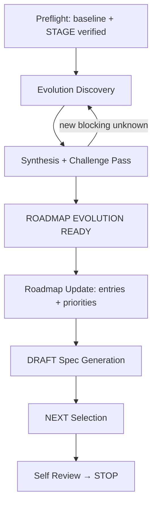

# evolve-dev — Overview & State Machine

`evolve-dev` plans the next delivery wave on a baselined repository: it turns a new direction, a learned constraint, or a delivery wave into confirmed Roadmap entries, DRAFT Specs, and re-prioritized ordering — **without touching implementation**. It plans what comes next; `feature-dev` remains the only path that implements it.

## When it triggers

**Enter only when** the user explicitly asks for post-delivery Roadmap evolution on a repository with a credible macro baseline: planning a new Feature wave, adding Roadmap entries, re-prioritizing, or updating the macro baseline incrementally.

**Do not enter** for implementing one Feature (→ `feature-dev`), Greenfield initialization (→ `coding-start`), unknown-repository takeover (→ `project-onboard`), maintenance engineering such as refactoring, debt paydown, upgrades, or deprecation (→ `maintenance-dev`), or read-only evaluation.

**The repositioning boundary**: a direction that would overturn the macro baseline itself — product repositioning, a new core user base, replacing the primary product goal — is beyond incremental evolution. The Skill reports the boundary and `STOP`s for an explicit user decision to redo macro design.

## The executable state machine

Use these exact stage tokens in the Stage activity: `PREFLIGHT`, `EVOLUTION_DISCOVERY`, `SYNTHESIS_CHALLENGE`, `ROADMAP_UPDATE`, `DRAFT_SPEC_GENERATION`, `NEXT_SELECTION`, `BLOCKED_HANDOFF`, `SELF_REVIEW`, `STOP`.

Root [`STAGE.md`](../guide/project-stage) is created or incrementally adopted after valid entry and explicit local-write authorization, under the standard write guard. Before the Gate it may use Work Status `N/A` and `N/A - project workflow activity`.

## Gates at a glance

| Gate | Page |
|---|---|
| `ROADMAP EVOLUTION READY` | [Lifecycle & Gate](./lifecycle) |

The Gate records `Status: PASS | NOT_READY | STALE`, an input manifest, validation time, and Roadmap Decision Authority approval source and scope — like every Foundry Gate.

## Interview protocol in one paragraph

Investigate the repository first (Roadmap, delivery history, Open Questions, debt records, Stage claims are primary evidence — never ask the user what the repo already answers). Ask 2–5 related high-impact questions per round in `STANDARD`; one decision question in `DEEP` when the wave touches critical business rules, irreversible data, cross-Feature contracts, or an unresolved baseline conflict. Maintain the Decision Ledger (`CONFIRMED / RECOMMENDED / UNKNOWN`); never repeat answered questions; never decide fields, DTOs, or components. See [Lifecycle & Gate](./lifecycle).

## NEXT selection

The recommended selection is the smallest validating set, usually one Feature. Additional parallel selections are confirmed only when distinct members will claim them. An entry claimed by another member is `NEEDS_CONFIRMATION`, never rewritten. If nothing can safely become `NEXT`, the run ends in `BLOCKED_HANDOFF` with zero `NEXT` entries and the handoff token `EVOLUTION INCOMPLETE`. Implementation is the next member's `feature-dev` run — this Skill never invokes it.

## Mandatory STOP conditions

1. The direction overturns the macro baseline and the user has not explicitly decided to redo macro design.
2. The repository lacks a credible macro baseline or a resolvable language policy.
3. A required Roadmap Decision Authority cannot be reached for a blocking priority or scope decision.
4. A claimed-by-another-member entry would need modification and confirmation is unavailable.
5. Local-write authorization is missing for the required artifact paths.
