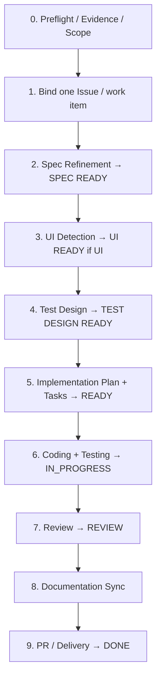

# feature-dev — Overview & State Machine

`feature-dev` advances **exactly one** selected Feature, Change, or Bug from fact confirmation to verifiable delivery. It follows project conventions and must not redesign the project baseline or absorb unrelated Features.

## When it triggers

**Enter only when** the user explicitly asks to implement, fix, or deliver one selected work item. It supports both a Greenfield `DRAFT` Spec and a Brownfield `AS_IS_DRAFT` / `RECONSTRUCTED` Spec.

**Do not enter** for read-only review, diagnosis/explanation only, ordinary Q&A, Greenfield initialization (→ `coding-start`), or unknown-repository onboarding (→ `project-onboard`).

## The executable state machine

Roadmap status flows `DRAFT → NEXT → READY → IN_PROGRESS → REVIEW → DONE`, with any active state able to move to `BLOCKED` (recording `Blocked From`). A `DONE` Feature's Bug/Change uses a **new** work-item ID and never erases the parent's completion state.

## Preflight context

Before anything else, read the applicable `AGENTS.md` chain and Language Policy, then discover and read: `README`, `PRODUCT`, `ARCHITECTURE`, `DATABASE`, `API`, `TESTING`, `ROADMAP`, the current Spec, Dependency Specs, relevant ADRs, relevant code and tests, and the existing Issue/work item. If UI impact is possible, also read `FRONTEND`, `UX`, `UI`, `DESIGN_SYSTEM`, affected pages, and existing components.

If Code / Spec / Docs / UI disagree, resolve the mismatch, repair the baseline, or enter Design Change **before** any gate. If the project baseline is missing, route to `coding-start` (Greenfield) or `project-onboard` (Brownfield) and `STOP`.

## Gates at a glance

| Gate | Page |
|---|---|
| `SPEC READY` | [Issue & Spec](./spec) |
| `UI READY` | [UX / UI](./ui) |
| `TEST DESIGN READY` | [Test Design](./testing) |
| `DONE` | [Delivery](./delivery) |

Every gate records `Status: PASS | NOT_READY | STALE`, a complete input manifest, validation time, and Decision Authority approval source and scope. A semantic input change marks downstream gates `STALE`.

## Mandatory STOP conditions

1. The scope is not exactly one selected work item.
2. A Greenfield lacks a project-level baseline, or a Brownfield lacks trustworthy onboarding.
3. A Critical Open Question is `OPEN`/`DEFERRED`, a Language Policy is missing/conflicting/unpersisted, a material Docs/Code conflict is unresolved, or a core requirement is unverifiable.
4. After all autonomous clarification, a required gate still cannot be met because an external decision, evidence, or environment is unavailable (a normal initial `NOT_READY` refines instead of stopping).
5. A Design Change affecting approved behavior lacks Decision Authority confirmation, or L2/L3 confirmation is incomplete.
6. A user decision is required for tracker/work item, major dependency, destructive migration, or delivery standard.
7. A required Git/remote side effect lacks authorization, tooling, or authentication.

Every `STOP` reports current Roadmap Status, passed/skipped gates, blocking evidence, who must answer what, and the resume step.
