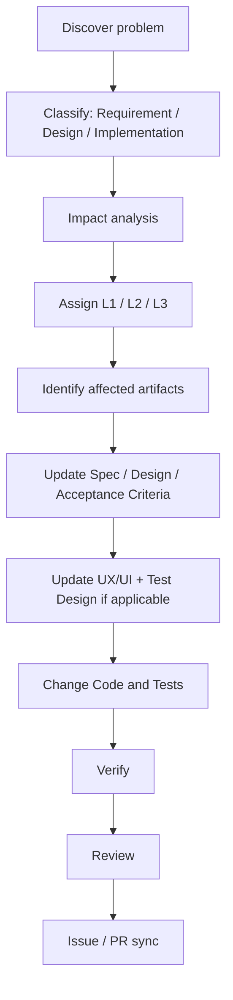

# Design Change Policy

Design is allowed to change — but only through a controlled flow. The forbidden shortcut is:

```text
discover problem → change code → leave docs stale
```

Foundry's rule: **Code must never stay ahead of Docs.** An emergency experiment may provide short-term verification, but it must not be delivered as the final implementation before the sources of truth are synchronized.

## The standard flow



## Impact levels

| Level | Scope | Trigger examples | Must update |
|---|---|---|---|
| **L1** | Feature-local | A change within one Feature | Current Spec, Test Design, necessary API / Database / UI |
| **L2** | Cross-Feature | Multiple Features, a shared contract, Roadmap, Design System | Related Specs, API, DATABASE, UX/UI, DESIGN_SYSTEM, ROADMAP, Tests, necessary Architecture |
| **L3** | Architectural | Module boundary, major tech choice, Source of Truth, messaging, cache, authentication, DB strategy, frontend architecture, global navigation, Design System core, API style, consistency model | Every truly affected document + **ADR**, plus related Specs, AGENTS, Tests |

Only genuinely affected documents are updated — never extra files to make the change look comprehensive.

## Authority requirements

- **L1** — a named Decision Authority empowered for that Feature confirms any change to approved Scope, `AC-*`, an external contract, observable behavior, or user-visible copy. L1 describes impact scope only; it is not automatic authorization.
- **L2** — named Decision Authorities for all affected Features confirm scope and choice; if unconfirmed, `STOP`.
- **L3** — a named `Architecture Decision Authority` confirms the decision. An ADR records Context, Decision, Alternatives, Consequences, the authority, and the decision revision.

For L3, coding may resume only after the ADR reaches the project's **implementation-authorizing state** (for example, `Accepted` or `Effective`).

## Downstream gates go stale

A Design Change marks affected gates `STALE` through the invalidation chain, and they must be re-validated before work resumes. See [Workflow & Gates](../workflow) for the chain.

## Not a Design Change

A reversible **implementation refinement** that changes no requirement, contract, or observable behavior is not a Design Change — it updates only the Implementation Plan.
