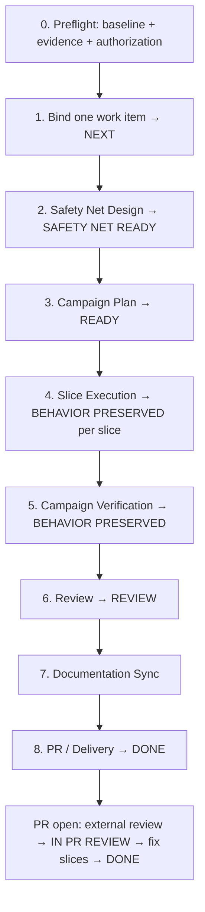

# maintenance-dev — Overview & State Machine

`maintenance-dev` advances **exactly one** maintenance campaign from safety net to verified delivery: behavior-preserving refactoring, technical-debt paydown, a dependency/framework upgrade, or deprecating/removing a capability. It keeps observable behavior identical to the baseline — except `RETIRE`, where the behavior change is the point and carries the strictest authority trail in the suite.

## When it triggers

**Enter only when** the user explicitly asks for maintenance engineering on a repository with a trustworthy baseline: "refactor the auth module", "pay down the recorded debt", "upgrade React 18 to 19", "deprecate the legacy export API" — one campaign per run.

**Do not enter** for new business capability (→ `feature-dev`), Roadmap planning of a new wave (→ `evolve-dev`), Greenfield initialization (→ `coding-start`), unknown-repository takeover (→ `project-onboard`), or a debt survey / read-only diagnosis without an explicitly requested campaign.

## Campaign types

| Type | Trigger | Invariant |
|---|---|---|
| `REFACTOR` | Improve structure without changing behavior | Observable behavior identical to baseline |
| `DEBT` | Pay down recorded technical-debt rows | Identical to baseline; defect fixes split to `feature-dev` |
| `UPGRADE` | Move a dependency/framework/toolchain version | Identical except explicitly recorded, authority-accepted breaking changes |
| `RETIRE` | Deprecate and remove a capability | Exactly the authority-approved retirement delta |

A request that would change behavior beyond the approved retirement is misclassified: it routes to `feature-dev` as a Change — with its own `SPEC READY` gate — instead.

## The executable state machine

Use these exact stage tokens in the Stage activity: `PREFLIGHT`, `WORK_ITEM_BINDING`, `SAFETY_NET_DESIGN`, `CAMPAIGN_PLAN`, `SLICE_EXECUTION`, `BEHAVIOR_VERIFICATION`, `REVIEW`, `DOCUMENTATION_SYNC`, `DELIVERY`, `PR_REVIEW`, `COMPLETE`.

Roadmap status flows the standard `DRAFT → NEXT → READY → IN_PROGRESS → REVIEW → DONE` with the same claim, `WIP Limit`, and fix-slice rules as `feature-dev`. The ADR-0001 protocol (tracker-first authority, branch-per-work-item, integration, PR peer review) is inherited unchanged.

## Gates at a glance

| Gate | Page |
|---|---|
| `SAFETY NET READY` | [Safety Net & Verification](./safety-net) |
| `BEHAVIOR PRESERVED` | [Safety Net & Verification](./safety-net) |
| `DONE` | Suite delivery standard (same as `feature-dev`) |

A concurrent claim on an overlapping surface is a manifest input of `SAFETY NET READY`: mark it `STALE` and revalidate before merge.

## Mandatory STOP conditions

1. The request is not exactly one maintenance campaign, or the campaign would change observable behavior without a named Decision Authority's confirmed intended-behavior decision.
2. The repository lacks a trustworthy baseline, a resolvable language policy, or readable evidence for the affected surfaces.
3. `SAFETY NET READY` cannot be reached for a surface the campaign must touch.
4. A required Decision Authority is unavailable for a blocking approval (retirement decision, breaking-change acceptance, priority or delivery standard).
5. Local-write paths or generated-output boundaries lack explicit authorization.
6. An L2/L3 impact discovered mid-campaign lacks complete authority confirmation, or L3 lacks an implementation-authorizing ADR.
7. A required Git/remote side effect lacks authorization, tooling, or authentication.
8. Stage binding, freshness, revision/hash, activity identity, duplicate assignment, or authority transfer is unresolved.
