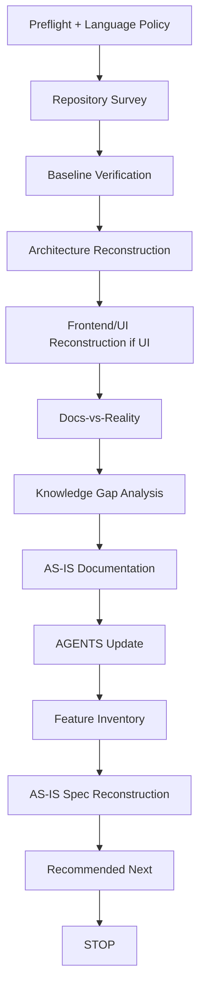
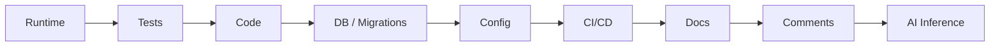

# project-onboard — Overview & Evidence Model

`project-onboard` recovers an unfamiliar existing repository into a verifiable, traceable, transferable `AS-IS` baseline. **Understand reality before discussing `TO-BE`.** It never refactors toward an ideal architecture and never implements anything.

## When it triggers

**Enter only when** the user explicitly asks to take over, inventory, or recover an existing Brownfield / legacy / incomplete repository. First entry into an unknown repo is **not** a trigger. Do not enter for ordinary Q&A, read-only review, diagnosis-only work, Greenfield initialization (use [`coding-start`](../coding-start/)), or single-Feature implementation (use [`feature-dev`](../feature-dev/)).

## The flow

Root [`STAGE.md`](../guide/project-stage) checkpoints each meaningful transition for every active human or Agent. It records only the onboarding stage, ref, blockers, handoffs, resume points, and authority links; AS-IS facts still belong to the Baseline, canonical docs, Roadmap, and Specs.

## Evidence priority

Investigation and conflict weighting follow this order (it is a guide, not blind trust):

Environment-mismatched runtime, stale tests, and dead code can all mislead — and **existing code is not automatically correct design**.

## The eight evidence labels

Every claim carries exactly one label; `INFERRED` is never rewritten as an unlabeled fact.

| Label | Meaning |
|---|---|
| `OBSERVED` | Directly seen in runtime/UI/behavior |
| `DOCUMENTED` | Stated by existing documentation |
| `CONFIRMED` | Cross-verified or confirmed by a maintainer |
| `INFERRED` | Derived by reasoning; needs caution |
| `NEEDS_CONFIRMATION` | Requires a human answer |
| `CONFLICT` | Sources disagree; recorded side by side |
| `UNKNOWN` | Not yet knowable from current evidence |
| `MISSING` | An expected artifact/protection is absent |

## Docs-vs-Reality

Compare Docs vs Code vs Tests vs Runtime vs UI and record every conflict side by side — e.g. `README: Java 17` vs `pom.xml: Java 21`, or a UX doc describing a modal while the current UI navigates directly. Conflicts are never silently resolved by rank.

## Knowledge Gaps

After exhausting repository evidence, record conflicts, unknowns, missing items, impact, the smallest validation action, and suspected Technical Debt. Ask the user only high-impact questions the repository cannot answer; unanswered items stay `NEEDS_CONFIRMATION`.

## Guardrails

- No source change before baseline verification; no broad refactor, dependency upgrade, repo-wide formatting, data migration, or batch debt fix during onboarding.
- Only the documentation needed to understand the project is modified; source defects are recorded and classified, not fixed here.
- Valid repository content and history are preserved; merge incrementally, never replace to fit a template.
- Preserve unrelated `STAGE.md` activity rows. A stale projection or unexplained duplicate work claim is `CONFLICT`, never an excuse to overwrite another member.
- Local artifact authorization is separate from Git/remote authorization. See [Authorization](../guide/authorization).

The skill ends by recommending **one** next item (`Recommended Next`) and `STOP`s — it does not implement it.
