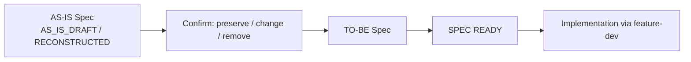

# project-onboard — Reconstruction & AS-IS

Reconstruction turns evidence into a labeled `AS-IS` picture: what the system currently does, not what it should do.

## Architecture Reconstruction

Cross-check entry points, data, and observable boundaries to recover the current state of:

```text
Modules · Packages · Entry Points · Domain · Request Flow · Data Flow ·
Dependencies · DB · Cache · MQ · Auth · Transactions · Jobs ·
External Services · Deployment
```

The output is an **AS-IS Architecture**. Do not optimize the design, and do not diagram an ideal module boundary as current architecture — put improvements in Technical Debt.

## Frontend / UI Reconstruction (when a UI exists)

Recover, from outside in:

```text
Page Map → Routes → Navigation → Layouts → User Flows →
Component Structure → State Management → API Layer → Design Tokens → UI Library
```

Identify current pages, navigation, existing and reusable components, UI state patterns, design tokens, responsive behavior, accessibility, and current UX problems. With no UI, record `N/A` and create no placeholder doc.

::: warning Observed pattern ≠ required convention
Existing UI is evidence, not a Design System. If buttons use 6px, 8px, and 12px radius inconsistently, do **not** write "the project allows three random radii." Mark it `CONFLICT` / Technical Debt / Needs Confirmation — it may be historical debt.
:::

## AS-IS Documentation

Incrementally create or update `README`, `AGENTS`, and `docs/*` (plus `FRONTEND/UX/UI/DESIGN_SYSTEM` when a UI exists):

- **Preserve** valid content.
- **Mark** unknowns and conflicts explicitly.
- **Correct** evidenced stale claims.
- **Never** write inference as fact, and **never** change behavior.
- Never invent an ADR for an unevidenced historical decision.

## Feature Inventory

Identify **what is already implemented**, grouped by understandable business capability or user outcome (not per endpoint/class/component). Each Feature gets an implementation state:

| State | Meaning |
|---|---|
| `IMPLEMENTED` | Core current behavior works with no known blocking gap |
| `PARTIAL` | Only part of a critical path, state, or role works |
| `BROKEN` | Evidence shows an expected core path currently fails |
| `UNKNOWN` | Evidence is insufficient |
| `DEPRECATED` | Explicit evidence shows retirement |

The Inventory lives only in `specs/ROADMAP.md` (never a parallel inventory), recording implementation state, work status, dependencies, current behavior, evidence, conflicts/unknowns, and test coverage separately.

## AS-IS Specs

For code without specs, reconstruct current behavior from Runtime, Tests, Code, API, Database, and UI into AS-IS Specs with status:

- `RECONSTRUCTED` — critical behavior is traceable and sufficiently evidenced.
- `AS_IS_DRAFT` — critical behavior, boundaries, or conflicts remain unresolved.
- Never `READY` — onboarding cannot promote a spec to ready, and must not fill gaps with guesses.

Existing tests and UI are evidence, not absolute truth: record what is covered, what is broken/skipped/flaky, and which tests bind only to implementation details.

## AS-IS → TO-BE



Every AS-IS Spec carries a `TO-BE Handoff`: later, [`feature-dev`](../feature-dev/) decides what to preserve, change, or remove, produces the TO-BE Spec, and passes `SPEC READY` before implementation.

## Technical Debt

Identify, classify, record, and **recommend** — never batch-fix. Categories include circular dependencies, giant services, controller business logic, missing/broken tests, stale docs, duplicate logic, dead code, unsafe transactions, hidden dependencies, inconsistent UI, missing loading/error states, accessibility issues, duplicated components, and inconsistent design tokens.

## Recommended Next

Recommend **one** next item using confirmed priority, broken core flows, security/data risk, blockers, implementation completeness, and test protection. `Recommended Next` is a proposal; `Work Status: NEXT` is a selection.

- Record rationale, dependencies, risks, alternatives, evidence label, and recommendation-selection metadata (`RECOMMENDED` until selected, then `SELECTED`).
- Set `NEXT` only after explicit confirmation by the named `Roadmap Decision Authority` or proof from the authoritative tracker; otherwise preserve status (`UNTRACKED` if no history).
- Multiple existing `NEXT` items are recorded as `CONFLICT` and confirmed — never silently rewritten.
