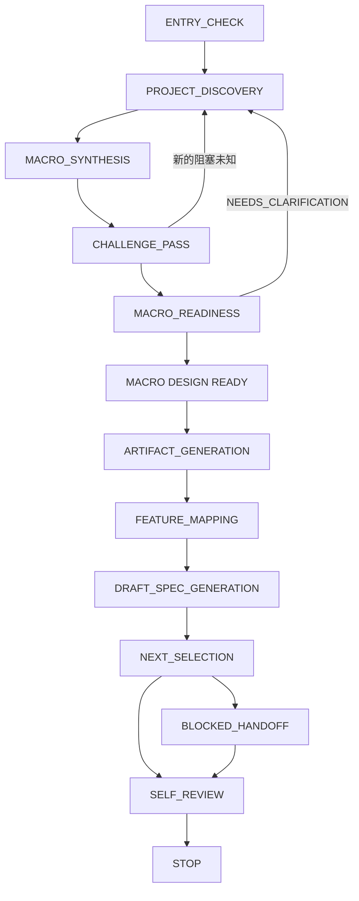

# coding-start —— 总览与状态机

`coding-start` 把一个尚未实现的项目想法推进到可交给 Feature 开发的状态。它先澄清方向、边界与长期规则，**再**产出项目级文档与浅层 Feature 地图。默认不写业务代码、不搭全量脚手架。

## 何时触发

**仅当**用户明确要求启动/初始化一个 Greenfield 项目时进入——包括"为一个尚无宏观基线的项目描述单个 Feature"的情形。

**不进入**的情形：

- 目录已有实质业务代码、可运行系统、迁移或历史行为 → 转 [`project-onboard`](../project-onboard/)。
- 用户想开发/修复单个 Feature 且已有可信宏观基线 → 转 [`feature-dev`](../feature-dev/)。
- 用户只想讨论/评估，或未授权写盘 → 可访谈或回答，但停在正式产物之前。

Greenfield 与 Brownfield 不明时，只问一个入口判定问题；绝不猜测或覆盖已有内容。

## 状态机

正式项目文档只在 `MACRO DESIGN READY` 之后生成。访谈摘要与候选建议不是正式产物。

## 不可违反的边界

- 默认不创建业务实现、业务 API、数据库表、领域类、页面或组件。
- 默认不生成全量应用脚手架。
- 宏观设计只固定**方向、边界、规则、约束**——不得冻结 DTO、字段、类、组件、内部函数、消息主题、缓存键或像素细节。
- 不得深化 `DRAFT` Spec，不得运行 `SPEC READY` / `UI READY` / `TEST DESIGN READY`。
- 不得创建 Feature 实现 Issue 或 PR（属于 `feature-dev`）。
- 本地写盘授权不包含 `git commit/push`、远程 Issue/PR、merge 或 release。见[授权](../guide/authorization)。

## 最小非业务脚手架（例外）

仅当用户明确要求，且在 `MACRO DESIGN READY` 之后、另有独立的脚手架写盘授权时，才可创建最小非业务脚手架（包管理、格式化、测试入口、空应用入口）。其中**不得**包含业务逻辑、示例实体、占位接口、完整 Schema 或 UI 页面——且真实命令须同步进 README/TESTING/AGENTS。

## STOP 条件

成功路径仅当以下全部为真才停止：

1. 项目访谈完成。
2. Challenge Pass 完成，且 Decision Authority 确认了修正后的综合。
3. 正式文件写盘已获明确本地授权（未推导 Git/远程授权）。
4. Gate 明确输出 `MACRO DESIGN READY`。
5. 适用的宏观文档存在、一致，且遵循语言策略。
6. `UI: YES` 有宏观 UX/UI 文档；`UI: NO` 记录了跳过决定。
7. `AGENTS.md` 包含长期规则与语言策略。
8. Feature Map、依赖分析与 Roadmap 存在。
9. 每个 Feature 都有浅层 DRAFT Spec。
10. 恰好一个经权限确认的 `NEXT`（或零 `NEXT` 的 `BLOCKED_HANDOFF`）。
11. 无业务代码；已授权的最小脚手架通过验证。Self Review 完成且所有发现已修复。

成功时，`coding-start` 建议把唯一的 `NEXT` 交给 `feature-dev`——但不会自动调用它。
