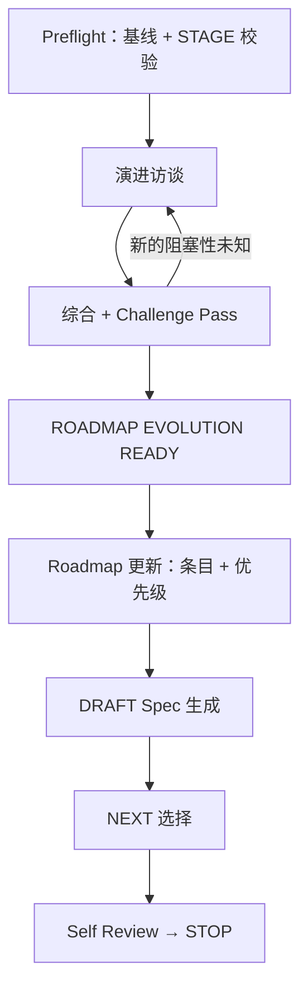

# evolve-dev —— 总览与状态机

`evolve-dev` 在有基线的仓库上规划下一个交付波次：把新方向、新认知或新交付波次变成经确认的 Roadmap 条目、DRAFT Spec 和重排后的优先级——**不触碰实现**。它规划"接下来做什么"；实现永远是 `feature-dev` 的事。

## 触发条件

**仅在**用户明确要求在具有可信宏观基线的仓库上做交付后 Roadmap 演进时进入：规划新的 Feature 波次、新增 Roadmap 条目、重排优先级、增量更新宏观基线。

**不进入**：实现单个 Feature（→ `feature-dev`）、Greenfield 初始化（→ `coding-start`）、未知仓库接管（→ `project-onboard`）、维护期工程（重构/还债/升级/弃用，→ `maintenance-dev`）、只读评估。

**重定位边界**：会推翻宏观基线本身的方向——产品重定位、新的核心用户群、替换主要产品目标——超出增量演进的范围。Skill 报告边界并 `STOP`，交由用户显式决定是否重走宏观设计。

## 可执行状态机

Stage 活动使用这些精确令牌：`PREFLIGHT`、`EVOLUTION_DISCOVERY`、`SYNTHESIS_CHALLENGE`、`ROADMAP_UPDATE`、`DRAFT_SPEC_GENERATION`、`NEXT_SELECTION`、`BLOCKED_HANDOFF`、`SELF_REVIEW`、`STOP`。

有效进入并取得本地写授权后，按标准写守卫创建或增量接管根 [`STAGE.md`](../guide/project-stage)。门禁之前可用 Work Status `N/A` 与 `N/A - project workflow activity`。

## 门禁一览

| 门禁 | 页面 |
|---|---|
| `ROADMAP EVOLUTION READY` | [生命周期与门禁](./lifecycle) |

该门禁与所有 Foundry 门禁一样记录 `Status: PASS | NOT_READY | STALE`、输入清单、验证时间与 Roadmap Decision Authority 批准来源及范围。

## 访谈协议一段话

先查仓库（Roadmap、交付历史、Open Questions、债务记录、Stage 认领都是一手证据——仓库能回答的绝不问用户）。`STANDARD` 每轮问 2–5 个相关高影响问题；波次触及关键业务规则、不可逆数据、跨 Feature 契约或未解基线冲突时升级 `DEEP`，每轮只问一个决策问题。维护决策账本（`CONFIRMED / RECOMMENDED / UNKNOWN`）；不重复问已答问题；不提前决策字段、DTO、组件。详见[生命周期与门禁](./lifecycle)。

## NEXT 选择

推荐最小验证集，通常一个 Feature。仅当确有不同成员认领时才确认更多并行选择。他人认领的条目记 `NEEDS_CONFIRMATION`，绝不改写。若没有条目能安全成为 `NEXT`，运行以零 `NEXT` 的 `BLOCKED_HANDOFF` 结束，交接令牌为 `EVOLUTION INCOMPLETE`。实现是下一位成员的 `feature-dev` 运行——本 Skill 绝不自动调用。

## 强制 STOP 条件

1. 方向推翻宏观基线，且用户尚未显式决定重走宏观设计。
2. 仓库缺少可信宏观基线或可解析的语言策略。
3. 阻塞性的优先级/范围决策无法联系到 Roadmap Decision Authority。
4. 需要修改他人认领的条目且确认不可得。
5. 所需产物路径缺少本地写授权。
