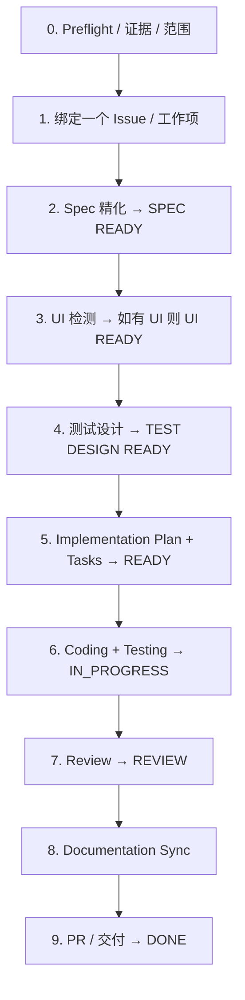

# feature-dev —— 总览与状态机

`feature-dev` 把**恰好一个**选定的 Feature / Change / Bug 从事实确认推进到可验证的交付。它遵循项目约定，绝不重新设计项目基线，也不吞并无关 Feature。

## 何时触发

**仅当**用户明确要求实现、修复或交付一个选定的工作项时进入。既支持 Greenfield 的 `DRAFT` Spec，也支持 Brownfield 的 `AS_IS_DRAFT` / `RECONSTRUCTED` Spec。

**不进入**：只读评审、仅诊断/解释、普通问答、Greenfield 初始化（→ `coding-start`）、未知仓库接管（→ `project-onboard`）。

## 可执行状态机

Roadmap 状态流转 `DRAFT → NEXT → READY → IN_PROGRESS → REVIEW → DONE`，任何活跃状态都可转入 `BLOCKED`（记录 `Blocked From`）。`DONE` Feature 的 Bug/Change 使用**新的**工作项 ID，绝不抹除父 Feature 的完成状态。

## Preflight 上下文

首先读取适用的 `AGENTS.md` 链与语言策略，然后发现并读取：`README`、`PRODUCT`、`ARCHITECTURE`、`DATABASE`、`API`、`TESTING`、`ROADMAP`、当前 Spec、依赖 Specs、相关 ADR、相关代码与测试、既有 Issue/工作项。若可能有 UI 影响，还要读 `FRONTEND`、`UX`、`UI`、`DESIGN_SYSTEM`、受影响页面与既有组件。

若 Code / Spec / Docs / UI 不一致，先解决分歧、修复基线或进入 Design Change，**再**谈门禁。若项目基线缺失，路由到 `coding-start`（Greenfield）或 `project-onboard`（Brownfield）并 `STOP`。

## 门禁速览

| 门禁 | 页面 |
|---|---|
| `SPEC READY` | [Issue 与 Spec](./spec) |
| `UI READY` | [UX / UI](./ui) |
| `TEST DESIGN READY` | [测试设计](./testing) |
| `DONE` | [交付](./delivery) |

每个门禁记录 `Status: PASS | NOT_READY | STALE`、完整输入清单、验证时间与 Decision Authority 批准来源和范围。输入的语义变化会使下游门禁 `STALE`。

## 强制 STOP 条件

1. 范围不是恰好一个选定的工作项。
2. Greenfield 缺项目级基线，或 Brownfield 缺可信 onboarding。
3. Critical Open Question 处于 `OPEN`/`DEFERRED`、语言策略缺失/冲突/未持久化、重大 Docs/Code 冲突未解决、或核心需求不可验证。
4. 穷尽自主澄清后，某必需门禁仍因外部决策、证据或环境不可得而无法达成（初次正常的 `NOT_READY` 进入精化而非停止）。
5. 影响已批准行为的 Design Change 缺 Decision Authority 确认，或 L2/L3 确认不完整。
6. 需要用户决策：tracker/工作项、重大依赖、破坏性迁移、交付标准。
7. 必需的 Git/远程副作用缺授权、缺工具或认证。

每次 `STOP` 都报告当前 Roadmap 状态、已通过/跳过的门禁、阻塞证据、谁需要回答什么、以及恢复步骤。
