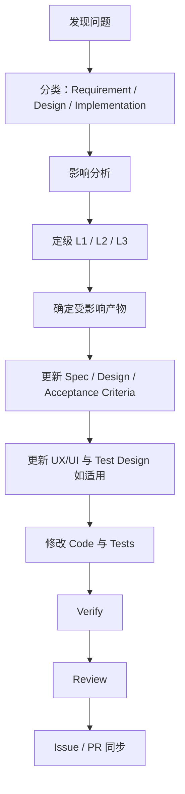

# 设计变更策略

设计允许变化——但必须走受控流程。被禁止的捷径是：

```text
发现问题 → 直接改代码 → 文档不动
```

Foundry 的规则：**代码绝不能长期领先于文档。**紧急实验可以做短期验证，但在事实来源同步之前，不得作为最终实现交付。

## 标准流程



## 影响等级

| 级别 | 范围 | 触发示例 | 必须更新 |
|---|---|---|---|
| **L1** | 单 Feature | 一个 Feature 内的变更 | 当前 Spec、Test Design、必要的 API / Database / UI |
| **L2** | 跨 Feature | 多个 Feature、共享契约、Roadmap、Design System；合并冲突揭示了共享契约或 Spec 上的语义冲突时同样适用（见[并行协作](./parallel-work)） | 相关 Specs、API、DATABASE、UX/UI、DESIGN_SYSTEM、ROADMAP、Tests、必要的 Architecture |
| **L3** | 架构级 | 模块边界、重大技术选型、Source of Truth、消息、缓存、认证、数据库策略、前端架构、全局导航、Design System 核心、API 风格、一致性模型 | 每个真正受影响的文档 + **ADR**，以及相关 Specs、AGENTS、Tests |

只更新真正受影响的文档——绝不为让变更显得全面而添加额外文件。

## 权限要求

- **L1** —— 由该 Feature 的命名 Decision Authority 确认任何对已批准 Scope、`AC-*`、外部契约、可观察行为或用户可见文案的变更。L1 只表示影响范围，不是自动授权。
- **L2** —— 由所有受影响 Feature 的命名 Decision Authority 确认范围与选择；未确认则 `STOP`。
- **L3** —— 由命名的 `Architecture Decision Authority` 确认决策。ADR 记录 Context、Decision、Alternatives、Consequences、权限与决策 revision。

L3 决策只有在 ADR 达到项目的**实施授权状态**（例如 `Accepted` 或 `Effective`）后，才能恢复编码。

## 下游门禁失效

Design Change 会沿失效链把受影响的门禁标记为 `STALE`，恢复工作前必须重新验证。失效链见[工作流与门禁](../workflow)。

## 不算 Design Change

不改变任何需求、契约或可观察行为的、可逆的**实现细化**不算 Design Change——只更新 Implementation Plan。
