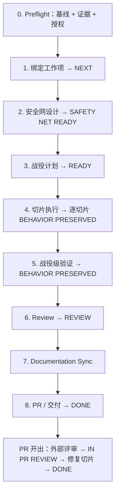

# maintenance-dev —— 总览与状态机

`maintenance-dev` 把**恰好一个**维护战役从安全网推进到可验证交付：行为保持重构、技术债清理、依赖/框架升级，或弃用/移除某个能力。它保持可观察行为与基线一致——唯一的例外是 `RETIRE`，行为变更本身就是目的，因此携带全套件最严格的权限链条。

## 触发条件

**仅在**用户明确要求在具有可信基线的仓库上做维护工程时进入："重构鉴权模块"、"清理记录在案的技术债"、"把 React 18 升到 19"、"下线旧的导出 API"——每次运行一个战役。

**不进入**：新业务能力（→ `feature-dev`）、新波次 Roadmap 规划（→ `evolve-dev`）、Greenfield 初始化（→ `coding-start`）、未知仓库接管（→ `project-onboard`）、没有明确战役的债务调查/只读诊断。

## 战役类型

| 类型 | 触发 | 不变量 |
|---|---|---|
| `REFACTOR` | 不改行为的前提下改善结构 | 可观察行为与基线一致 |
| `DEBT` | 清理已记录的技术债行 | 与基线一致；缺陷修复拆给 `feature-dev` |
| `UPGRADE` | 依赖/框架/工具链版本迁移 | 除显式记录且经权限接受的破坏性变更外一致 |
| `RETIRE` | 弃用并移除某个能力 | 恰好等于权限批准的退役差异 |

会超出批准退役范围改变行为的请求属于分类错误：路由到 `feature-dev` 作为 Change 处理——走它自己的 `SPEC READY` 门禁。

## 可执行状态机

Stage 活动使用这些精确令牌：`PREFLIGHT`、`WORK_ITEM_BINDING`、`SAFETY_NET_DESIGN`、`CAMPAIGN_PLAN`、`SLICE_EXECUTION`、`BEHAVIOR_VERIFICATION`、`REVIEW`、`DOCUMENTATION_SYNC`、`DELIVERY`、`PR_REVIEW`、`COMPLETE`。

Roadmap 状态走标准 `DRAFT → NEXT → READY → IN_PROGRESS → REVIEW → DONE`，认领、`WIP Limit`、修复切片规则与 `feature-dev` 相同。ADR-0001 协议（tracker 权威、branch-per-work-item、集成、PR 评审）原样继承。

## 门禁一览

| 门禁 | 页面 |
|---|---|
| `SAFETY NET READY` | [安全网与验证](./safety-net) |
| `BEHAVIOR PRESERVED` | [安全网与验证](./safety-net) |
| `DONE` | 套件交付标准（与 `feature-dev` 相同） |

重叠表面上的并发认领是 `SAFETY NET READY` 的输入清单项：标记 `STALE` 并在合并前重验证。

## 强制 STOP 条件

1. 请求不是恰好一个维护战役，或战役将在没有具名 Decision Authority 确认预期行为变更的情况下改变可观察行为。
2. 仓库缺少可信基线、可解析的语言策略，或受影响表面缺少可读证据。
3. 战役必须触及的表面无法达到 `SAFETY NET READY`。
4. 阻塞性批准（退役决策、破坏性变更接受、优先级或交付标准）所需的 Decision Authority 联系不上。
5. 本地写路径或生成产物边界缺少明确授权。
6. 战役中途发现的 L2/L3 影响缺少完整权限确认，或 L3 缺少处于实现授权状态的 ADR。
7. 当前步骤所需的 Git/远程副作用缺少授权、工具或认证。
8. Stage 绑定、新鲜度、修订/哈希、活动身份、重复认领或权限转移未解决。
