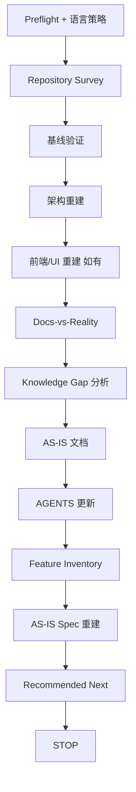
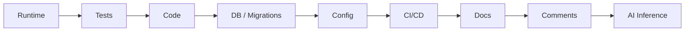

# project-onboard —— 总览与证据模型

`project-onboard` 把陌生的已有仓库恢复为可验证、可追溯、可交接的 `AS-IS` 基线。**先理解现实，再讨论 `TO-BE`。**它绝不向理想架构重构，也绝不实现任何功能。

## 何时触发

**仅当**用户明确要求接管、盘点或恢复一个已有的 Brownfield / legacy / 半成品仓库时进入。仅仅第一次进入陌生仓库**不会**触发。普通问答、只读评审、仅诊断、Greenfield 初始化（用 [`coding-start`](../coding-start/)）、单 Feature 实现（用 [`feature-dev`](../feature-dev/)）均不进入。

## 流程

## 证据优先级

调查与冲突加权遵循以下顺序（是指引，不是盲信）：

环境不匹配的 Runtime、过时测试、死代码都可能误导——而且**已有代码不等于正确设计**。

## 八种证据标签

每个论断恰好携带一个标签；`INFERRED` 绝不被改写为无标签事实。

| 标签 | 含义 |
|---|---|
| `OBSERVED` | 在 runtime/UI/行为中直接观察到 |
| `DOCUMENTED` | 由既有文档所述 |
| `CONFIRMED` | 交叉验证或经维护者确认 |
| `INFERRED` | 由推理得出；需谨慎 |
| `NEEDS_CONFIRMATION` | 需要人类回答 |
| `CONFLICT` | 来源相互矛盾；并列记录 |
| `UNKNOWN` | 当前证据尚不可知 |
| `MISSING` | 预期的产物/保护缺失 |

## Docs-vs-Reality

对比 Docs vs Code vs Tests vs Runtime vs UI，并列记录每一处冲突——例如 `README: Java 17` vs `pom.xml: Java 21`，或 UX 文档描述提交后弹 Modal 而当前 UI 直接跳转。冲突绝不按优先级静默裁决。

## Knowledge Gaps

穷尽仓库证据后，记录冲突、未知、缺失项、影响、最小验证动作与疑似技术债。只向用户提出仓库无法回答的高影响问题；未回答项保持 `NEEDS_CONFIRMATION`。

## 护栏

- 基线验证前不改源码；onboarding 期间不做大规模重构、依赖升级、全库格式化、数据迁移或批量还债。
- 只修改理解项目所需的文档；源码缺陷只记录与分类，不在此修复。
- 保留有效的仓库内容与历史；增量合并，绝不为套模板而替换。
- 本地产物授权与 Git/远程授权相互独立。见[授权](../guide/authorization)。

Skill 以推荐**一项**后续工作（`Recommended Next`）收尾并 `STOP`——不实现它。
