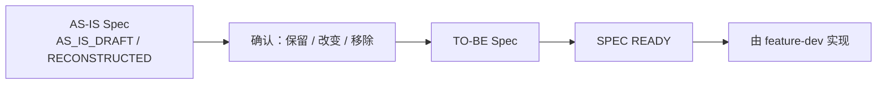

# project-onboard —— 重建与 AS-IS

重建把证据变成带标签的 `AS-IS` 图景：系统当前在做什么，而不是它应该做什么。

## 架构重建

从入口、数据与可观察边界交叉核对，恢复以下现状：

```text
模块 · 包 · 入口点 · 领域 · 请求流 · 数据流 · 依赖 · 数据库 ·
缓存 · 消息队列 · 认证 · 事务 · 任务 · 外部服务 · 部署
```

产出是 **AS-IS 架构**。不要优化设计，也不要把理想的模块边界画成当前架构——改进放入技术债。

## 前端 / UI 重建（存在 UI 时）

由外到内恢复：

```text
Page Map → Routes → Navigation → Layouts → User Flows →
Component Structure → State Management → API Layer → Design Tokens → UI Library
```

识别当前页面、导航、既有与可复用组件、UI 状态模式、design tokens、响应式行为、可访问性与当前 UX 问题。无 UI 时记 `N/A`，不建占位文档。

::: warning 观察到的模式 ≠ 要求的规范
已有 UI 是证据，不是 Design System。如果按钮混用 6px、8px、12px 圆角，**不要**写"项目允许三种随机圆角"。标记为 `CONFLICT` / 技术债 / 待确认——它可能是历史债务。
:::

## AS-IS 文档

增量创建或更新根 `STAGE.md`、`README`、`AGENTS` 与 `docs/*`（有 UI 时另加 `FRONTEND/UX/UI/DESIGN_SYSTEM`）。Stage 只承载当前协作与权威链接：

- **保留**有效内容。
- **标记**未知与冲突。
- **修正**有证据支撑的过期论断。
- **绝不**把推断写成事实，也**绝不**改变行为。
- 绝不为无证据的历史决策伪造 ADR。

## Feature Inventory

识别**已经实现了什么**，按可理解的业务能力或用户结果分组（不按 endpoint/类/组件机械拆分）。每个 Feature 获得一个实现状态：

| 状态 | 含义 |
|---|---|
| `IMPLEMENTED` | 核心当前行为可用，无已知阻塞缺口 |
| `PARTIAL` | 部分存在，但某条关键路径、状态或角色缺失或不可用 |
| `BROKEN` | 证据表明某条预期核心路径当前失败 |
| `UNKNOWN` | 证据不足以做出负责任的判断 |
| `DEPRECATED` | 有显式证据表明已退役；仅看似死代码不足以判定 |

Inventory 只存放在 `specs/ROADMAP.md`（绝不另建平行清单），分别记录实现状态、工作状态、依赖、当前行为、证据、冲突/未知与测试覆盖。

## AS-IS Specs

对没有 Spec 的代码，从 Runtime、Tests、Code、API、Database、UI 逆向重建当前行为，生成 AS-IS Spec，状态为：

- `RECONSTRUCTED` —— 关键行为可追溯、证据充分。
- `AS_IS_DRAFT` —— 关键行为、边界或冲突尚未解决。
- 绝不 `READY` —— onboarding 不能把 Spec 提升为 ready，也不得用猜测填补空白。

已有测试与 UI 是证据，不是绝对真理：记录覆盖了什么、哪些 broken/skipped/flaky、哪些测试只绑定实现细节。

## AS-IS → TO-BE



每份 AS-IS Spec 都携带 `TO-BE Handoff`：之后由 [`feature-dev`](../feature-dev/) 决定保留、改变或移除什么，产出 TO-BE Spec，并在实现前通过 `SPEC READY`。

## 技术债

只识别、分类、记录、**推荐**——绝不批量修复。类别包括循环依赖、巨型服务、Controller 业务逻辑、缺失/损坏测试、过期文档、重复逻辑、死代码、不安全事务、隐藏依赖、UI 不一致、缺失 loading/error 状态、可访问性问题、重复组件、design tokens 不一致。

## Recommended Next

用已确认的优先级、核心流程破损、安全/数据风险、阻塞、实现完整度与测试保护，推荐**一项**后续工作。`Recommended Next` 是提案；`Work Status: NEXT` 才是选择。

- 记录理由、依赖、风险、替代项、证据标签与推荐-选择元数据（未选为 `RECOMMENDED`，选定后为 `SELECTED`）。
- 仅在命名的 `Roadmap Decision Authority` 明确确认、或权威 tracker 有证据时才设为 `NEXT`；否则保留原状态（无历史则 `UNTRACKED`）。
- 既有多个 `NEXT` 记为 `CONFLICT` 并请求确认——绝不静默改写。
